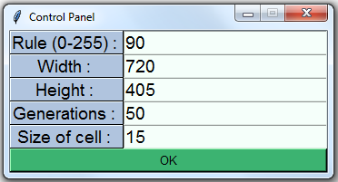

# elementary-cellular-automaton
Used Tkinter and webbrowser libraries with Python in order to implement the simle elementary cellular automaton explained in the following sources:   
http://mathworld.wolfram.com/ElementaryCellularAutomaton.html
https://natureofcode.com/book/chapter-7-cellular-automata/

## About
Cellular automata are models used to simulate and study social self organization. ex. How people live in a city.    
A cellular automaton consists of a regular grid of cells, each in one of a finite number of states, such as on and off.  
The grid can be in any finite number of dimensions. For each cell, a set of cells called its neighborhood is defined relative to the specified cell. An initial state (time t = 0) is selected by assigning a state for each cell. A new generation is created (advancing t by 1), according to some fixed rule that determines the new state of each cell in terms of the current state of the cell and the states of the cells in its neighborhood.  
The simplest one is the elementary cellular automaton. 

## Version 1.0
- used Tkinter  to implement the GUI  
- used webbrowser to learn the library and implement a couple of links to interesting sources  
- all 255 rules can are simulated correctly  
- made sure to not have any errors occur through the use of python exceptions  
- all 4 categories of cellular automata can be seen in the different rules of my implementation   

